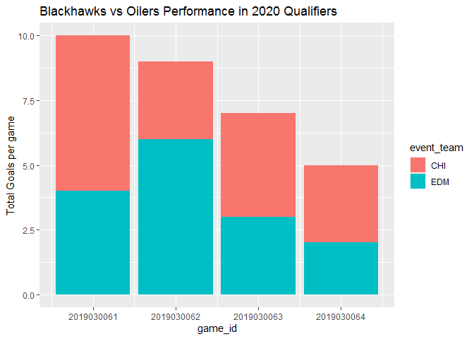
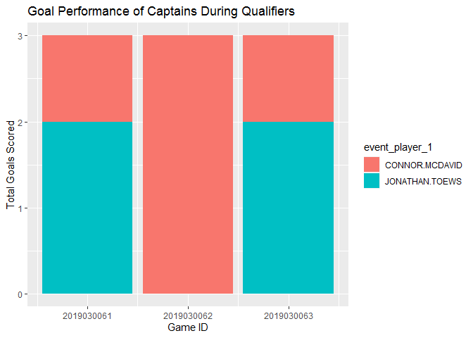

Introduction
============

We will look at the results of the 2020 Qualifying Round between the
Chicago Blackhawks and the Edminton Oilers

This analysis will look at the following:

1.  Goals scored overall
2.  How the captians (Connor McDavid and Jonathon Toews) Performed goal
    wise

Importing the Data
==================

``` r
library(tidyverse)
```

    ## Warning: package 'ggplot2' was built under R version 4.0.2

    ## Warning: package 'stringr' was built under R version 4.0.2

We will run a scraper that will pull in the data we need (this is
already included in the `hockey_scraper.R` script that I built earlier)

``` r
source('hockey_scraper.R')
```

    ## 
    ## Attaching package: 'RCurl'

    ## The following object is masked from 'package:tidyr':
    ## 
    ##     complete

    ## Warning: package 'xml2' was built under R version 4.0.2

    ## 
    ## Attaching package: 'rvest'

    ## The following object is masked from 'package:purrr':
    ## 
    ##     pluck

    ## The following object is masked from 'package:readr':
    ## 
    ##     guess_encoding

    ## Warning: package 'jsonlite' was built under R version 4.0.2

    ## 
    ## Attaching package: 'jsonlite'

    ## The following object is masked from 'package:purrr':
    ## 
    ##     flatten

    ## Warning: package 'foreach' was built under R version 4.0.2

    ## 
    ## Attaching package: 'foreach'

    ## The following objects are masked from 'package:purrr':
    ## 
    ##     accumulate, when

    ## Warning: package 'lubridate' was built under R version 4.0.2

    ## 
    ## Attaching package: 'lubridate'

    ## The following objects are masked from 'package:base':
    ## 
    ##     date, intersect, setdiff, union

    ## Warning: Missing column names filled in: 'X2' [2]

    ## Parsed with column specification:
    ## cols(
    ##   Game_ID = col_double(),
    ##   X2 = col_logical()
    ## )

    ## Processing 4 Games: 2019030061-2019030064 // Full Scrape
    ## -------------
    ## 2019030061...

    ## `summarise()` ungrouping output (override with `.groups` argument)

    ## `summarise()` ungrouping output (override with `.groups` argument)

    ## 10.5 sec 
    ## 2019030062...

    ## `summarise()` ungrouping output (override with `.groups` argument)
    ## `summarise()` ungrouping output (override with `.groups` argument)

    ## 6.8 sec 
    ## 2019030063...

    ## `summarise()` ungrouping output (override with `.groups` argument)
    ## `summarise()` ungrouping output (override with `.groups` argument)

    ## 7.5 sec 
    ## 2019030064...

    ## `summarise()` ungrouping output (override with `.groups` argument)
    ## `summarise()` ungrouping output (override with `.groups` argument)

    ## 8 sec 
    ## ------------- 
    ##  4 of 4 games returned // Avg Time Per Game: 8.2

We will clean up the workspace as we now have our data in the csv file

``` r
rm(list = ls())
```

``` r
CHI_Playoff_data <- read_csv("CHI_Playoff_data.csv")
```

    ## Parsed with column specification:
    ## cols(
    ##   .default = col_character(),
    ##   season = col_double(),
    ##   game_id = col_double(),
    ##   game_date = col_date(format = ""),
    ##   event_index = col_double(),
    ##   game_period = col_double(),
    ##   game_seconds = col_double(),
    ##   event_length = col_double(),
    ##   coords_x = col_double(),
    ##   coords_y = col_double(),
    ##   num_on = col_double(),
    ##   num_off = col_double(),
    ##   home_on_7 = col_logical(),
    ##   away_on_7 = col_logical(),
    ##   home_skaters = col_double(),
    ##   away_skaters = col_double(),
    ##   home_score = col_double(),
    ##   away_score = col_double()
    ## )

    ## See spec(...) for full column specifications.

    ## Warning: 4 parsing failures.
    ##  row       col           expected              actual                   file
    ## 2532 away_on_7 1/0/T/F/TRUE/FALSE RYAN.NUGENT-HOPKINS 'CHI_Playoff_data.csv'
    ## 2533 away_on_7 1/0/T/F/TRUE/FALSE RYAN.NUGENT-HOPKINS 'CHI_Playoff_data.csv'
    ## 2534 away_on_7 1/0/T/F/TRUE/FALSE RYAN.NUGENT-HOPKINS 'CHI_Playoff_data.csv'
    ## 2535 away_on_7 1/0/T/F/TRUE/FALSE RYAN.NUGENT-HOPKINS 'CHI_Playoff_data.csv'

Data Cleaning
=============

Our analysis is only concerned with the following how many goals were
scored overall throughout the series and the performance of the two
captains

Performance in this case will be defined as goals and assists

``` r
goals <- CHI_Playoff_data %>% filter(event_type == "GOAL")
```

For now we will leave the player names as they are simply becase they do
not distract from the analysis we are performing (they are all captial)

Team Analysis
=============

Now we will look at the goals per game

``` r
goals <- goals %>% mutate(goals = ifelse(event_type == "GOAL", 1, 0))
```

``` r
goals_per_game <- goals %>% group_by(game_id) %>% summarise(total_goals = sum(goals))
```

    ## `summarise()` ungrouping output (override with `.groups` argument)

Let’s make this a little bit easier to understand as we want to see a
team breakdown per game

``` r
goals_per_game_team <- goals %>% filter(!is.na(event_team)) %>% group_by(game_id, event_team) %>% summarise(total_goals = sum(goals))
```

    ## `summarise()` regrouping output by 'game_id' (override with `.groups` argument)

Plotting goals per game between two teams

``` r
ggplot(data = goals_per_game_team) +
  geom_col(aes(x = game_id, y = total_goals, fill = event_team)) +
  labs(title = "Blackhawks vs Oilers Performance in 2020 Qualifiers", y = "Total Goals per game")
```



Captains performance
====================

We have so far looked at the overall team performance now let’s look at
the captains compared to each other in this series

The series was a best of 5 meaning 3 games are needed to advance unlike
a best of 7 series where 4 games are needed to advance

``` r
captain_goals <- goals %>% filter(event_player_1 %in% c("CONNOR.MCDAVID", "JONATHAN.TOEWS"))
```

Note that I am **not** looking at how the captains did point wise which
also includes assists just how many goals these two players scored

Applying cleaning so that we can perform analysis

``` r
captain_goals <- captain_goals %>% mutate(goals = ifelse(event_type == "GOAL", 1, 0))
```

Finally applying split-apply-combine using `group_by` and `summarise`

``` r
captain_performance <- captain_goals %>% group_by(event_player_1, game_id) %>% summarise(total_captain_goals = sum(goals))
```

    ## `summarise()` regrouping output by 'event_player_1' (override with `.groups` argument)

``` r
head(captain_performance)
```

    ## # A tibble: 5 x 3
    ## # Groups:   event_player_1 [2]
    ##   event_player_1    game_id total_captain_goals
    ##   <chr>               <dbl>               <dbl>
    ## 1 CONNOR.MCDAVID 2019030061                   1
    ## 2 CONNOR.MCDAVID 2019030062                   3
    ## 3 CONNOR.MCDAVID 2019030063                   1
    ## 4 JONATHAN.TOEWS 2019030061                   2
    ## 5 JONATHAN.TOEWS 2019030063                   2

Finally plotting the result (the hat trick that McDavid had is giving
him the edge here)

``` r
ggplot(data = captain_performance) +
  geom_col(aes(x = game_id, y = total_captain_goals, fill = event_player_1)) +
  labs(title = "Goal Performance of Captains During Qualifiers", x = "Game ID", y = "Total Goals Scored")
```


