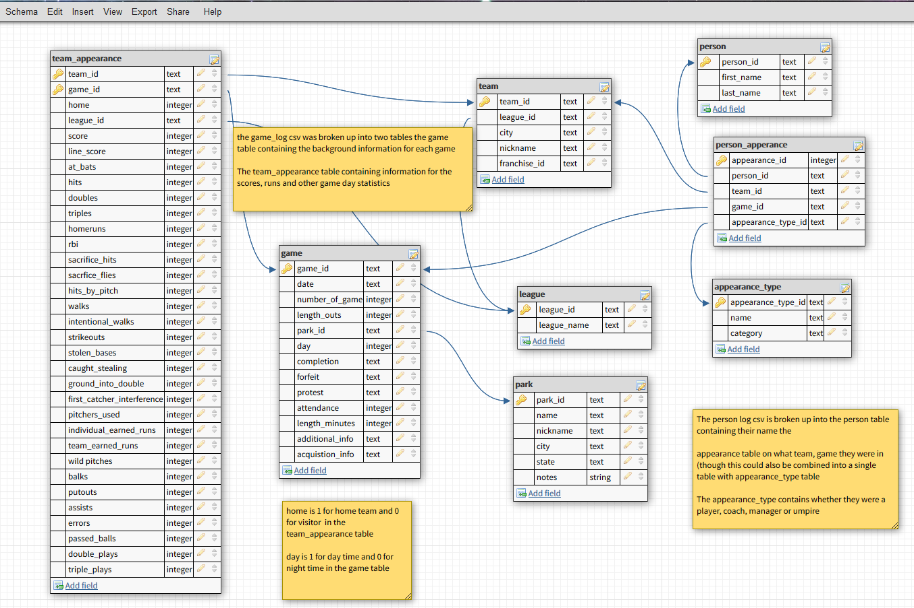

# Introduction
This project is creating an sqlite database from CSV files.  The CSV files are taken from [Retrosheet](https://www.retrosheet.org/gamelogs/index.html) which is a site that tracks game statistics for Major League Baseball from the 1800s to today

# Exploring the Data
```{r}
library(tidyverse)
library(RSQLite)
library(DBI)
```

First let's read in the game_log, person_codes, park_codes and team_codes files
```{r}
# To avoid trouble with column types we will set them to a specific type (character, integer, etc.)
game_log <- read_csv("game_log.csv",
                     col_types = cols(.default = "c",
                       v_league = "c", h_league = "c",
                       `3b_umpire_id` = "c", `3b_umpire_name` = "c",
                       `lf_umpire_id` = "c", `lf_umpire_name` = "c",
                       `rf_umpire_id` = "c",  `rf_umpire_name` =  "c",
                       completion = "c", winning_rbi_batter_id = "c",
                       winning_rbi_batter_id_name = "c", "protest" = "c",
                       v_first_catcher_interference = "c",
                     h_first_catcher_interference = "c"))
head(game_log)
```

```{r}
dim(game_log)
```

There are over 170,000 games (171907) which are organized by year from 1871 to 2016

Each game has the following information
* General game information
* Team level statistics
* Umpires that officiated the game
* Awards such as winning/losing pitcher, saving pitcher, Game winning RBI batter

There is no column that shows us that it is a primary key column

```{r}
person_codes <- read_csv("person_codes.csv")
head(person_codes)
```
```{r}
dim(person_codes)
```

This is a list of people with IDs that correspond to the gamelog.  There are debut dates for players, managers, coaches and umpires.  Managers are more like head coaches and coaches are like assistant coaches.  Coaches are not in the game logs.

```{r}
park_codes <- read_csv("park_codes.csv")
head(park_codes)
```
```{r}
dim(park_codes)
```

This is a list of all baseball parks with IDs that match the game log (retrosheet says that this is for column 17 of the game log)

```{r}
team_codes <- read_csv("team_codes.csv")
head(team_codes)
```
```{r}
dim(team_codes)
```

This is a list of all teams with Ids that match the game log

## Defensive positions
The game log has defensive positions for each player listed 1-9 and both [wikipedia](https://en.wikipedia.org/wiki/Baseball_positions) and [Baseball Coaching Lab](http://baseballcoachinglab.com/baseball-positions/) list the following:

1. Pitcher
2. Catcher
3. First Baseman
4. Second Baseman
5. Third baseman
6. Shortsop
7. Left Fielder
8. Center Fielder
9. Right Fielder

## Leagues
According to Retrosheet these are the following leagues

* NA: National Association
* NL: National League
* AA: [American Association](https://en.wikipedia.org/wiki/American_Association_(19th_century))
* UA: [Union Association](https://en.wikipedia.org/wiki/Union_Association)
* PL: [Players League](https://en.wikipedia.org/wiki/Players%27_League)
* AL: American League
* FL: [Federal League](https://en.wikipedia.org/wiki/Federal_League)

# Importing Data into SQLite
We will now import our dataframes into sql tables and in the game_log table include a game_id that is the date home team and the number of game.  This game_id is based on the id entry from [here](https://www.retrosheet.org/eventfile.htm)

```{r}
conn <- dbConnect(SQLite(), "mlb.db")

# Create the game_log table
dbWriteTable(conn = conn, name = "game_log",
             value = game_log, row.names = FALSE, header = TRUE)

# Create the person_codes table
dbWriteTable(conn = conn, name = "person_codes",
             value = person_codes, row.names = FALSE, header = TRUE)

# Create the team_codes table
dbWriteTable(conn = conn, name = "team_codes",
             value = team_codes, row.names = FALSE, header = TRUE)

# Create park_codes table
dbWriteTable(conn = conn, name = "park_codes",
             value = park_codes, row.names = FALSE, header = TRUE)

# List all the tables
dbListTables(conn)
```

```{r}
# add the game_id column in game_log
add_game_id_command <- "
  ALTER TABLE game_log
  ADD COLUMN game_id TEXT
"

dbExecute(conn, add_game_id_command)

# Update this column based on Retrosheet specifications
update_game_id_command <-"
UPDATE game_log
SET game_id = date || h_name || number_of_game
/*WHERE stops this if it is already done*/
WHERE game_id IS NULL;
"

dbExecute(conn, update_game_id_command)
```
```{r}
# Verifying queries to confirm
check_game_id_query <- "
SELECT
  game_id,
  date,
  h_name,
  number_of_game
FROM game_log
LIMIT 5;
"
check_query <- dbGetQuery(conn, check_game_id_query)
head(check_query)
```

Checking in DBeaver also verifies that this column is there

# Looking for Normalization Opportunities
We can normalize our data in the following ways

* All debut dates from person_codes can be obtained from the game_log
* The start, end and sequence columns in team_codes can be obtained from the game_log
* The start and end years in park_codes can be obtained from the game_log
* We have a player_id followed by a player name in game_log we can remove those columns and use person_codes
* We have offensive and defensive statistics repeated in game_log for both the home and visiting teams.  We can remove these columns and put this in its own table
* We can remove the listing for 9 players on each team and place them in their own table that tracks player appearances and positions
* We can also remove the umpires from game_log and either place them in their own table or make a combined table with players, umpires, and managers
* We also have a few columns for awards which we can put in a separate table or combine them with generl appearances of players

# Planning a normalized schema
This is the schema that we are using here base on normalization created in DBDesigner.net


# Creating Tables Without Foreign Keys
Here we will create four tables based on our new schema:

* person
* park
* league
* appearance_type

```{r}
create_person_table <- "
CREATE TABLE IF NOT EXISTS person (
  person_id TEXT PRIMARY KEY,
  first_name TEXT,
  last_name TEXT
);
"

dbExecute(conn, create_person_table)

insert_into_person_table <- "
INSERT OR IGNORE INTO person
SELECT
  id,
  first,
  last
FROM person_codes;
"

dbExecute(conn, insert_into_person_table)

# Verify table
check_person_table <- "SELECT * FROM person LIMIT 5;"
check_person <- dbGetQuery(conn, check_person_table)
head(check_person)
```
```{r}
create_park_table <- "
CREATE TABLE IF NOT EXISTS park (
  park_id TEXT PRIMARY KEY,
  name TEXT,
  nickname TEXT,
  city TEXT,
  state TEXT,
  notes TEXT
);
"

dbExecute(conn, create_park_table)

insert_into_park_table <- "
INSERT OR IGNORE INTO park
SELECT
  park_id,
  name,
  aka,
  city,
  state,
  notes
FROM park_codes;
"
dbExecute(conn, insert_into_park_table)

# Verify table
check_park_table <- "SELECT * FROM park LIMIT 5;"
check_park <- dbGetQuery(conn, check_park_table)
head(check_park)
```


```{r}
create_league_table <- "
CREATE TABLE IF NOT EXISTS league (
  league_id TEXT PRIMARY KEY,
  name TEXT
);
"

dbExecute(conn, create_league_table)

insert_into_league_table <- '
INSERT OR IGNORE INTO league
VALUES
  ("NL", "National League"),
  ("AL", "American League"),
  ("AA", "American Association"),
  ("FL", "Federal League"),
  ("PL", "Players League"),
  ("UA", "Union Association")
;
'

dbExecute(conn, insert_into_league_table)

check_league_table <- "SELECT * FROM league"
check_league <- dbGetQuery(conn, check_league_table)
head(check_league)


```

```{r}
remove_appearance_type_table <- "DROP TABLE IF EXISTS appearance_type;"
dbExecute(conn, remove_appearance_type_table)

appearance_type <- read_csv("appearance_type.csv")
dbWriteTable(conn = conn, name = "appearance_type",
             value = appearance_type, row.names = FALSE, header = TRUE)

# Verify appearance_type table
check_appearance_type_table <- "SELECT * FROM appearance_type;"
check_appearance_type <- dbGetQuery(conn, check_appearance_type_table)
head(check_appearance_type)
```

# Adding the Team and Game Tables
We needed the league and park tables to create the team and game tables
```{r}
create_team_table <- "
CREATE TABLE IF NOT EXISTS team (
  team_id TEXT PRIMARY KEY,
  league_id TEXT,
  city TEXT,
  nickname TEXT,
  franch_id TEXT,
  FOREIGN KEY (league_id) REFERENCES league(league_id)
);
"

dbExecute(conn, create_team_table)

insert_into_team_table <- "
INSERT OR IGNORE INTO team
SELECT
  team_id,
  league,
  city,
  nickname,
  franch_id
FROM team_codes;
"
dbExecute(conn, insert_into_team_table)

# Verify team table
check_team_table <- "SELECT * FROM team LIMIT 5;"
check_team <- dbGetQuery(conn, check_team_table)
head(check_team)
```

```{r}
remove_game_table <- "DROP TABLE IF EXISTS game;"
dbExecute(conn, remove_game_table)

create_game_table <- "
CREATE TABLE IF NOT EXISTS game (
  game_id TEXT PRIMARY KEY,
  date TEXT,
  number_of_game INTEGER,
  park_id TEXT,
  length_outs INTEGER,
  day BOOLEAN,
  completion TEXT,
  forefit TEXT,
  protest TEXT,
  attendance INTEGER,
  length_minutes INTEGER,
  additional_info TEXT,
  acquisition_info TEXT,
  FOREIGN KEY (park_id) REFERENCES park(park_id)
);
"

dbExecute(conn, create_game_table)

insert_into_game_table <- '
INSERT OR IGNORE INTO game
SELECT
  game_id,
  date,
  number_of_game,
  park_id,
  length_outs,
  CASE
    WHEN day_night = "D" THEN 1
    WHEN day_night = "N" THEN 0
    ELSE NULL
    END
    AS day,
  completion,
  forefeit,
  protest,
  attendance,
  length_minutes,
  additional_info,
  acquisition_info
FROM game_log;
'

dbExecute(conn, insert_into_game_table)
check_game_table <- "SELECT * FROM game LIMIT 5;"
check_game <- dbGetQuery(conn, check_game_table)
head(check_game)
```

# Adding the Team Appearance Table
```{r}
remove_team_appearance_table <- "DROP TABLE IF EXISTS team_appearance;"
dbExecute(conn, remove_team_appearance_table)


create_team_appearance_table <- "
CREATE TABLE IF NOT EXISTS team_appearance (
  team_id TEXT,
  game_id TEXT,
  home BOOLEAN,
  league_id TEXT,
  score INTEGER,
  line_score TEXT,
  at_bats INTEGER,
  hits INTEGER,
  doubles INTEGER,
  triples INTEGER,
  homeruns INTEGER,
  rbi INTEGER,
  sacrifice_hits INTEGER,
  sacrifice_flies INTEGER,
  hit_by_pitch INTEGER,
  walks INTEGER,
  intentional_walks INTEGER,
  strikeouts INTEGER,
  stolen_bases INTEGER,
  caught_stealing INTEGER,
  grounded_into_double INTEGER,
  first_catcher_interference INTEGER,
  left_on_base INTEGER,
  pitchers_used INTEGER,
  individual_earned_runs INTEGER,
  team_earned_runs INTEGER,
  wild_pitches INTEGER,
  balks INTEGER,
  putouts INTEGER,
  assists INTEGER,
  errors INTEGER,
  passed_balls INTEGER,
  double_plays INTEGER,
  triple_plays INTEGER,
  PRIMARY KEY (team_id, game_id),
  FOREIGN KEY (team_id) REFERENCES team(team_id),
  FOREIGN KEY (game_id) REFERENCES game(game_id),
  FOREIGN KEY (team_id) REFERENCES team(team_id)
);
"

dbExecute(conn, create_team_appearance_table)

insert_into_team_appearance_table <- "
INSERT OR IGNORE INTO team_appearance
SELECT
  h_name,
  game_id,
  1 AS home,
  h_league,
  h_score,
  h_line_score,
  h_at_bats,
  h_hits,
  h_doubles,
  h_triples,
  h_homeruns,
  h_rbi,
  h_sacrifice_hits,
  h_sacrifice_flies,
  h_hit_by_pitch,
  h_walks,
  h_intentional_walks,
  h_strikeouts,
  h_stolen_bases,
  h_caught_stealing,
  h_grounded_into_double,
  h_first_catcher_interference,
  h_left_on_base,
  h_pitchers_used,
  h_individual_earned_runs,
  h_team_earned_runs,
  h_wild_pitches,
  h_balks,
  h_putouts,
  h_assists,
  h_errors,
  h_passed_balls,
  h_double_plays,
  h_triple_plays
FROM game_log
  
UNION
  
SELECT    
    v_name,
    game_id,
    0 AS home,
    v_league,
    v_score,
    v_line_score,
    v_at_bats,
    v_hits,
    v_doubles,
    v_triples,
    v_homeruns,
    v_rbi,
    v_sacrifice_hits,
    v_sacrifice_flies,
    v_hit_by_pitch,
    v_walks,
    v_intentional_walks,
    v_strikeouts,
    v_stolen_bases,
    v_caught_stealing,
    v_grounded_into_double,
    v_first_catcher_interference,
    v_left_on_base,
    v_pitchers_used,
    v_individual_earned_runs,
    v_team_earned_runs,
    v_wild_pitches,
    v_balks,
    v_putouts,
    v_assists,
    v_errors,
    v_passed_balls,
    v_double_plays,
    v_triple_plays
from game_log;
"

dbExecute(conn, insert_into_team_appearance_table)

check_team_appearance_table <- 
  "SELECT * FROM team_appearance
  WHERE game_id = (
                  SELECT MIN(game_id) from game
                  )
  OR game_id = (
                SELECT Max(game_id) from game
                )
  ORDER BY game_id, home;
"
check_team_appearance <- dbGetQuery(conn, check_team_appearance_table)
head(check_team_appearance)
```

# Adding the Person Appearance Table
```{r}
remove_person_appearance_table <- "DROP TABLE IF EXISTS person_appearance"

create_person_appearance_table <- "
CREATE TABLE person_appearance (
  appearance_id INTEGER PRMARY KEY,
  person_id TEXT,
  team_id TEXT,
  game_id TEXT,
  appearance_type_id,
  FOREIGN KEY (person_id) REFERENCES person(person_id),
  FOREIGN KEY (team_id) REFERENCES team(team_id),
  FOREIGN KEY (game_id) REFERENCES game(game_id)
  FOREIGN KEY (appearance_type_id) REFERENCES appearance_type(appearance_type_id)
);
"
dbExecute(conn, create_person_appearance_table)


insert_into_person_appearance_table <-'
INSERT OR IGNORE INTO person_appearance (
      game_id,
      team_id,
      person_id,
      appearance_type_id
  ) 
      SELECT
          game_id,
          NULL,
          hp_umpire_id,
          "UHP"
      FROM game_log
      WHERE hp_umpire_id IS NOT NULL    
  
  UNION
  
      SELECT
          game_id,
          NULL,
          [1b_umpire_id],
          "U1B"
      FROM game_log
      WHERE "1b_umpire_id" IS NOT NULL
  
  UNION
  
      SELECT
          game_id,
          NULL,
          [2b_umpire_id],
          "U2B"
      FROM game_log
      WHERE [2b_umpire_id] IS NOT NULL
  
  UNION
  
      SELECT
          game_id,
          NULL,
          [3b_umpire_id],
          "U3B"
      FROM game_log
      WHERE [3b_umpire_id] IS NOT NULL
  
  UNION
  
      SELECT
          game_id,
          NULL,
          lf_umpire_id,
          "ULF"
      FROM game_log
      WHERE lf_umpire_id IS NOT NULL
  
  UNION
  
      SELECT
          game_id,
          NULL,
          rf_umpire_id,
          "URF"
      FROM game_log
      WHERE rf_umpire_id IS NOT NULL
  
  UNION
  
      SELECT
          game_id,
          v_name,
          v_manager_id,
          "MM"
      FROM game_log
      WHERE v_manager_id IS NOT NULL
  
  UNION
  
      SELECT
          game_id,
          h_name,
          h_manager_id,
          "MM"
      FROM game_log
      WHERE h_manager_id IS NOT NULL
  
  UNION
  
      SELECT
          game_id,
          CASE
              WHEN h_score > v_score THEN h_name
              ELSE v_name
              END,
          winning_pitcher_id,
          "AWP"
      FROM game_log
      WHERE winning_pitcher_id IS NOT NULL
  
  UNION
  
      SELECT
          game_id,
          CASE
              WHEN h_score < v_score THEN h_name
              ELSE v_name
              END,
          losing_pitcher_id,
          "ALP"
      FROM game_log
      WHERE losing_pitcher_id IS NOT NULL
  
  UNION
  
      SELECT
          game_id,
          CASE
              WHEN h_score > v_score THEN h_name
              ELSE v_name
              END,
          saving_pitcher_id,
          "ASP"
      FROM game_log
      WHERE saving_pitcher_id IS NOT NULL
  
  UNION
  
      SELECT
          game_id,
          CASE
              WHEN h_score > v_score THEN h_name
              ELSE v_name
              END,
          winning_rbi_batter_id,
          "AWB"
      FROM game_log
      WHERE winning_rbi_batter_id IS NOT NULL
  
  UNION
  
      SELECT
          game_id,
          v_name,
          v_starting_pitcher_id,
          "PSP"
      FROM game_log
      WHERE v_starting_pitcher_id IS NOT NULL
  
  UNION
  
      SELECT
          game_id,
          h_name,
          h_starting_pitcher_id,
          "PSP"
      FROM game_log
      WHERE h_starting_pitcher_id IS NOT NULL;
'

dbExecute(conn, insert_into_person_appearance_table)
```
```{r}
# Add the players
for (letter in c("h", "v")) {
  for (num in 1:9) {
    template <- '
      INSERT INTO person_appearance (
          game_id,
          team_id,
          person_id,
          appearance_type_id
      ) 
          SELECT
              game_id,
              %s_name,
              %s_player_%f_id,
              "O%f"
          FROM game_log
          WHERE %s_player_%f_id IS NOT NULL
      
      UNION
      
          SELECT
              game_id,
              %s_name,
              %s_player_%f_id,
              "D" || CAST(%s_player_%f_def_pos AS INT)
          FROM game_log
          WHERE %s_player_%f_id IS NOT NULL;
    '
    # replace all of the %s and %f with the correct letter number
    template <- gsub("%s", letter, template, fixed = TRUE)
    template <- gsub("%f", num, template, fixed = TRUE)
    
    dbExecute(conn, template)
  }
}

# Verify the table
check_person_appearance_table <- "SELECT * FROM person_appearance LIMIT 5;"
check_person_appearance <- dbGetQuery(conn, check_person_appearance_table)
head(check_person_appearance)
```

# Remove the original tables
We already have all the table we need and it is now time to clean up the original tables from the csv files
```{r}
# Check the tables
dbListTables(conn)
```

```{r}
mlb_tables <- c("game_log", "park_codes", "person_codes", "team_codes")
for (m in mlb_tables) {
  drop_table = sprintf("DROP TABLE %s", m)
  dbExecute(conn, drop_table)
}

# Verify Tables are removed
dbListTables(conn)
```
```{r}
# Disconnect from database
dbDisconnect(conn)
```

